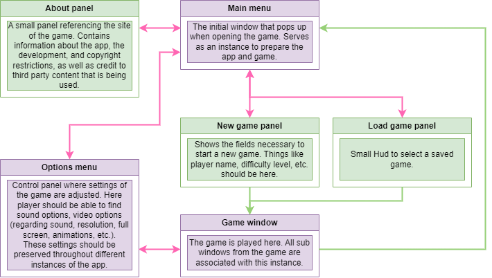

# Hackers of Blysis

> A game about hacking with its own programming language

## Background 🖥️
I'm sure you are familiar with the guy with a hoodie, staring at a black screen with green letters, writing dozens of lines of code to say "We're In" after a couple seconds. How some television series portrait the hacking experience as something exciting, intense, and battle-like against the defenses of *whatever software or server* they are trying to gain access to.
Well, this game aims to make that child dream come true. You are given the mission to get access to Blysis, the central server of a futuristic world where everything is connected, every person, every action, every sale, every emotion, everything is registered inside this giant server called Blysis. As an underground person, the resistance requests your help to get access to the server. In this game you will have different levels of complexity while trying to achieve your mission. Not only will you have to hack the defenses of the most advanced, modern, and secured server in this world, but you will also need to be very cautelous with *how* you do it as it might get the attention of civilians, or the Blaegis, a special unit dedicated to the protection and preservation of Blysis. If they find out about you, they will start attacking you back, while repairing every defense of the server, making it even more difficult to enter.

## Developing stages

Since I am developing this as I explore and extend my knowledge around the PyQt framework and all its capabilities, the stages will be very segmented between build-up functionality of the app and gaming features. The flow of the game should follow the next diagram.

    
    
<em>In this chart, purple bidirectional arrows mean a strict connection, i.e. if window <b>A</b> is accessed through window <b>B</b>, it can only go back to window <b>B</b> and not any of the other windows for which <b>A</b> has connections.</em>

As per usual, this chart might be modified if new windows or panels are added to complete features of the game. Note that the <i>Game Window</i> has sub windows and panels, but those are related to the gameplay itself, not the app management. Also, for any sub window of this <i>Game Window</i>, all connections from its parent are preserved.
The stages of development follow the path a user would take in the app; first the main window, options window, about panel, then new game, game window, and load game. In all of these, a minimum amount of frontend is needed to start adding features and functionality to the game. However, I do not intend to fulfill the minimum only. As mentioned earlier, this is a project to learn the full extent of the Qt framework, therefore, a lot of frontend will be created before moving to the next part.

## Modularization and directory

The app is extensively modularized. This means that parameters, settings, style definitions, and paths are separated from the constructor module. This is a non-extensive list of how the directory works.
*  `paths.json`: As its name suggests, contains the relative paths of all the source files in the directory, including images, sounds, style definitions, and parameters of different windows.
*  `*.qss`: Files with custom style sheets applied to QWidgets. These can found in the frontend folder.
*  (window)`parameters.json`: Files with different window parameters. These are related to the visual representation of the windows. Can also be found in the frontend folder.

Additionaly, module files are also segmented into different needs. For instance, `main_menu_signals.py` contains the `MainMenuSignals` class which is inherited by `MainMenuWindow` found in `main_menu.py`. This is to organize classes according to its contents and keep files below a certain number of lines, maintaining its readibility.