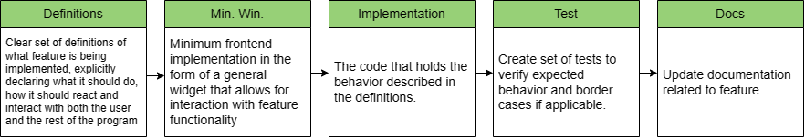

# Hackers of Blysis
[](https://github.com/users/3rdPix/projects/3)

[](https://github.com/3rdPix/HOB_Game/issues)
[](https://github.com/3rdPix/HOB_Game/issues)

[](https://www.gnu.org/licenses/gpl-3.0.en.html#license-text)


> A game about hacking - with its own programming language!

## Background Story - Motivation 🖥️

I'm sure you are familiar with the guy in a hoodie , staring at a black screen with green letters, writing dozens of lines of code to say "we're in" after a couple seconds. Due to how some television series or movies portrait the hacking experience, the idea of looking at it as something exciting, intense, and battle-like against the defenses of *whatever software or server* they are trying to gain access to is well embedded in popular culture. This game aims to take that scenario and turn it into a playable 

The game is set in a futuristic dystopian cyberpunk world where technology rules the way of life. In this world, there is a central server called Blysis that is managed and monitored by authorities and governments. This server keeps track of everything that happens in society going from local sales, detailed demographic statistics, stock exchanges, bank accounts, up to relationships, connections between people and behavioral patterns of all individuals. Gaining access to this server would mean gaining absolute control of everything that happens in society, economy, politics, nation relationships, etc.

As an experimented hacker, you are hired by the activists groups that fight for what they claim is *freedom* from this all-ruling IoT. Your mission is to gain access to the server and complete different tasks depending on the requests of the activists groups.

Not only will you have to hack the defenses of the most advanced, modern, and secured server in this world, but you will also need to be very cautelous with *how* you do it as it might get the attention of civilians, or the Blaegis, a special unit dedicated to the protection and preservation of Blysis. If they find out about you, they will start attacking you back, while repairing every defense of the server, making it even more difficult to enter.

## Game Flow

This project is still in very early development, meaning there is no release available nor a game to be played yet. There are however, some definitions that haven been made regarding the flow of the game. This is a chart that illustrates the minimum required windows for the game and how they are related to each other.

<div align="center">
    
    <p><em>In this chart, purple bidirectional arrows mean a strict connection, i.e. if window <b>A</b> is accessed through window <b>B</b>, it can only go back to window <b>B</b> and not any of the other windows for which <b>A</b> has connections.</em></p>
</div>

This flow may be modified if new windows or panels are added to complete features. Note that the <i>Game Window</i> has sub windows and panels, but those are related to the gameplay itself, not the app management. Also, for any sub window of this <i>Game Window</i>, all connections from its parent are preserved.

## Development

[](https://pypi.org/project/PyQt6/)
[](https://doc.qt.io/qtforpython-6/)
[](https://pep8.org/)

This project is developed in the **PyQt6** framework and its dependencies. To install the last version use:
```
pip install PyQt6
```
If you have any trouble running the program please submit your bug in [Issues](https://github.com/3rdPix/HOB_Game/issues) detailing the problem.

For every feature there is a minimum amount of frontend implementation that needs to be added before implementing the logic behind it. Definitions for the features and necesities they have are the first step whenever trying to add something new. This diagram tries to show in a capsule the flow of development for a new feature.

<div align="center">
    
</div>

### HobL


As mentioned, this game implements an environment for non-coders and developers to play a game that portraits the hacking experience seen in television and cinema. It does so, by creating scenarios that the player has to overcome creating functions and implementing them in [HobL](https://3rdpix.github.io/HOB_Game/). This is an invented scripting-like programming language which intends to be visually appealing (disclaimer: this is definitely not true from a developer's perspecetive, furthermore, HobL tries to be as far as possible from "clean, neat code") while being not hard to understand and learn so that new players can join the game without a very steep learning curve.

To achieve an increasing interest, the game can be played in its natural mode, which refers to the terminal environment with lines of code that need to be typed, or it can be played in block mode, where no code is required, but implementation of functions is done through interactions with the user interface.

HobL is fully implemented in Python and its documentation can be found in the GitHub's page of this repository: [here](https://3rdpix.github.io/HOB_Game/).

### Modularization and directory

The app is extensively modularized. This means that parameters, settings, style definitions, and paths are separated from the constructor module. This is a non-extensive list of how the directory works.
* `paths.json`: As its name suggests, contains the relative paths of all the source files in the directory, including images, sounds, style definitions, and parameters of different windows.
* `*.qss`: Files with custom style sheets applied to QWidgets. These can found in the frontend folder.
* (window)`parameters.json`: Files with different window parameters. These are related to the visual representation of the windows. Can also be found in the frontend folder.

The `app.py` module contains the `QApplication` that instances the game and connects all of frontend and backend signals, which can both be found in the `ft` and `bk` folders respectively. To run the program, make sure you have the needed libraries and then run
```
python execute.py
```
from the root directory. This should open the game in its latest version. Please note there is no stable release yet, expect errors.

